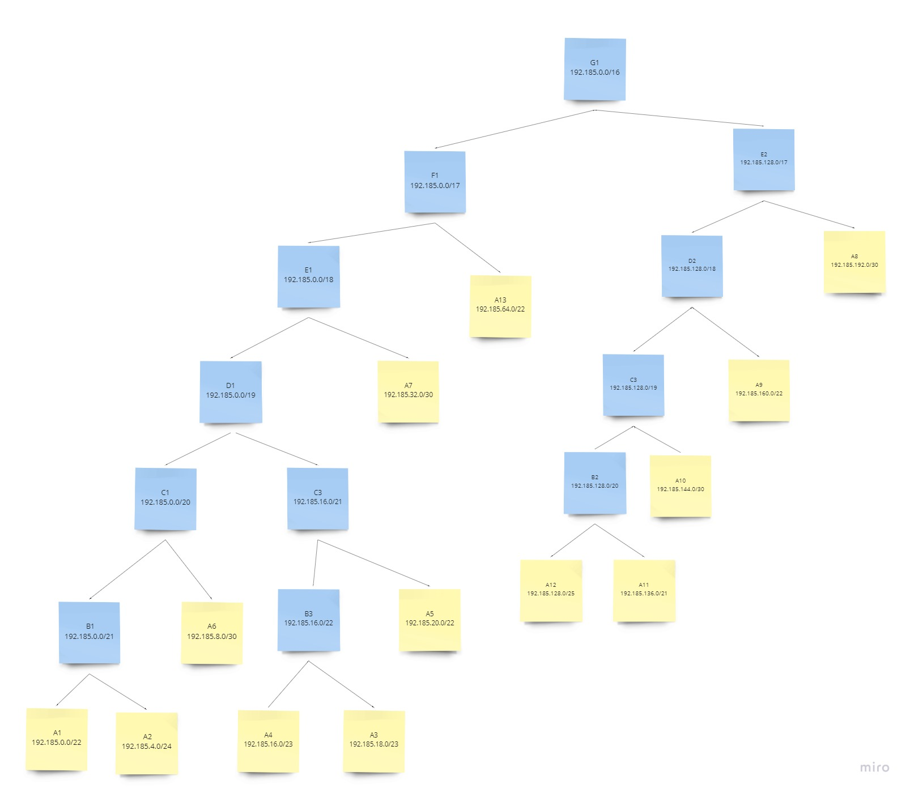
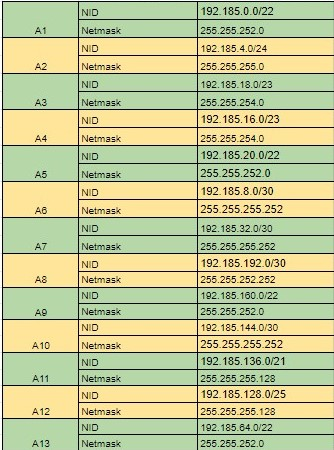
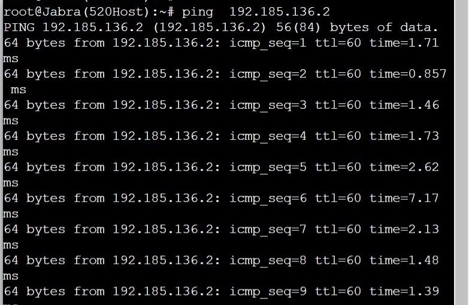

# Jarkom-Modul-4-C03-2021

Dibuat dengan sepenuh hati demi memenuhi Praktikum Jaringan Komputer Modul 4 Tahun 2021

.  
Junaedi Akbar. (05111940000041)  
Zydhan Linnar Putra (05111940000118)  
M.Fajri Davyza Chaniago (05111940000180)  
.

## Praktikum Modul 4 (📅 21 - 23 November 2021)

## Topologi Soal


## 💻 VLSM (Variable Length Subnet Masking)


### Jumlah Alamat IP

Subnet, jumlah IP untuk mendapatkan netmask dari tiap subnet ditunjukkan oleh tabel berikut
| Subnet | Jumlah IP | Netmask |
| :--- | :---: | ---: |
| ------------- | ------------- | ------------- |
| A1 | 721 | /22 |
| A2 | 252 | /24 |
| A3 | 13 | /28 |
| A4 | 502 | /23 |
| A5 | 521 | /22 |
| A6 | 2 | /30 |
| A7 | 2 | /30 |
| A8 | 2 | /30 |
| A9 | 701 | /22 |
| A10 | 2 | /30 |
| A11 | 2021 | /21 |
| A12 | 101 | /25 |
| A13 | 1001 | /22 |
| Total | 5841 | /19 |

### Pengaturan Konfigurasi IP

#### Konfigurasi IP Foosha

1. Mengarah Cloud  
   192.185.72.13 subnet 255.255.255.252
2. Mengarah Blueno  
   192.185.16.1 subnet 255.255.252.0
3. Mengarah Server Doriki  
   192.185.0.33 subnet 255.255.255.240
4. Mengarah Guanhao  
   192.185.0.5 subnet 255.255.255.252
5. Mengarah Water7  
   192.185.0.9 subnet 255.255.255.252

#### Konfigurasi IP Water7

1. Mengarah Foosha  
   192.185.0.10 subnet 255.255.255.252
2. Mengarah Cipher  
   192.185.12.1 subnet 255.255.255.0
3. Mengarah Pucci  
   192.185.0.13 subnet 255.255.255.252

#### Konfigurasi IP Pucci

1. Mengarah Water7  
   192.185.0.14 subnet 255.255.255.252
2. Mengarah Jipangu  
   192.185.0.129 subnet 255.255.255.128
3. Mengarah Courtyard dan Calmbelt  
   192.185.24.1 subnet 255.255.248.0

#### Konfigurasi IP Guanhao

1. Mengarah Foosha  
   192.185.0.6 subnet 255.255.255.252
2. Mengarah Jabra  
   192.185.8.1 subnet 255.255.252.0
3. Mengarah Alabasta  
   192.185.2.1 subnet 255.255.254.0
4. Mengarah OIMO  
   192.185.0.1 subnet 255.255.255.252

#### Konfigurasi IP Alabasta

1. Mengarah Guanhao  
   192.185.2.2 subnet 255.255.254.0
2. Mengarah Jorge  
   192.185.0.17 subnet 255.255.255.240

#### Konfigurasi IP OIMO

1. Mengarah Guanhao  
   192.185.0.2 subnet 255.255.255.252
2. Mengarah Server Fukurou  
   192.185.0.49 subnet 255.255.255.240
3. Mengarah Seastone  
   192.185.1.1 subnet 255.255.255.0

#### Konfigurasi IP Seastone

1. Mengarah OIMO  
   192.185.1.2 subnet 255.255.255.0
2. Mengarah Elena  
   192.185.4.1 subnet 255.255.252.0

#### Konfigurasi IP Jipangu

IP Address: 192.185.0.130
Subnet mask: 255.255.255.128

#### Konfigurasi IP Courtyard

IP Address: 192.185.24.2
Subnet mask: 255.255.248.0

#### Konfigurasi IP Calmbelt

IP Address: 192.185.24.3
Subnet mask: 255.255.248.0

#### Konfigurasi IP Cipher

IP Address: 192.185.12.2
Subnet mask: 255.255.252.0

#### Konfigurasi IP Blueno

IP Address: 192.185.16.2
Subnet mask: 255.255.252.0

#### Konfigurasi IP Jabra

IP Address: 192.185.8.2
Subnet mask: 255.255.252.0

#### Konfigurasi IP Maingate

IP Address: 192.185.2.3
Subnet mask: 255.255.254.0

#### Konfigurasi IP Jorge

IP Address: 192.185.0.18
Subnet mask: 255.255.255.240

#### Konfigurasi IP EniesLobby

IP Address: 192.185.1.3
Subnet mask: 255.255.255.0

#### Konfigurasi IP Elena

IP Address: 192.185.4.22
Subnet mask: 255.255.252.0

#### Konfigurasi IP Fukurou

IP Address: 192.185.0.50
Subnet mask: 255.255.255.240

#### Konfigurasi IP Doriki

IP Address: 192.185.0.34
Subnet mask: 255.255.255.2240

Pada Server Doriki memiliki IP 192.185.0.32

Pada Server Fukurou memiliki IP 192.185.0.48

### Pengaturan Routing

Untuk langkah nya bisa masuk kedalam router, lalu menekan menu static dan menambahkan data yang di inginkan

#### Pengaturan Routing Foosha

1. 192.185.4.0/22 via 192.185.0.6
2. 192.185.1.0/24 via 192.185.0.6
3. 192.185.0.16/28 via 192.185.0.6
4. 192.185.2.0/23 via 192.185.0.6
5. 192.185.8.0/22 via 192.185.0.6
6. 192.185.0.0/30 via 192.185.0.6
7. 192.185.12.0/22 via 192.185.0.10
8. 192.185.0.12/30 via 192.185.0.10
9. 192.185.0.128/25 via 192.185.0.10
10. 192.185.0.48/28 via 192.185.0.6
11. 192.185.24.0/21 via 192.185.0.10

#### Pengaturan Routing Water7

1. 0.0.0.0/0 via 192.185.0.9
2. 192.185.24.0/21 via 192.185.0.14
3. 192.185.0.128/25 via 192.185.0.14

#### Pengaturan Routing Pucci

1. 0.0.0.0/0 via 192.185.0.13

#### Pengaturan Routing Guanhao

1. 0.0.0.0/0 via 192.185.0.5
2. 192.185.4.0/22 via 192.185.0.2
3. 192.185.1.0/24 via 192.185.0.2
4. 192.185.0.16/28 via 192.185.2.2
5. 192.185.0.48/28 via 192.185.0.2

#### Pengaturan Routing Alabasta

1. 0.0.0.0/0 via 192.185.2.1

#### Pengaturan Routing OIMO

1. 0.0.0.0/0 via 192.185.0.1
2. 192.185.4.0/22 via 192.185.1.2

#### Pengaturan Routing Seastone

1. 0.0.0.0/0 via 192.185.1.1

## 💻 CIDR (Classless Inter Domain Routing)

Perhitungan pada teknik CIDR (Classless Inter Domain Routing) berdasarkan jumlah komputer/ host yang ada di dalam subnet dengan menggunakan GN3.

● Melakukan labelling netmask dengan langkah-langkah sebagai berikut:

**Langkah 1**


**Langkah 2**


**Langkah 3**


**Langkah 4**


**Langkah 5**


**Langkah 6**


● Lalu membuat tree sebagai berikut:


● Sehingga diperoleh tree:


dan diperoleh IP-IPnya



● Membuat topologi pada GNS3 sebagai berikut:

● Membuat konfigurasi IP pada GNS3 sebagai berikut:

**Foosha**

```
auto eth0
iface eth0 inet dhcp

auto eth1
iface eth1 inet static
        address 192.185.64.1
        netmask 255.255.255.252

auto eth2
iface eth2 inet static
         address 192.185.192.1
         netmask 255.255.255.252

auto eth3
iface eth3 inet static
        address 192.168.1.1
        netmask 255.255.255.252

auto eth4
iface eth4 inet static
        address 192.185.32.1
        netmask 255.255.255.252
```

**Water7**

```
auto eth0
iface eth0 inet static
       address 192.185.192.2
       netmask 255.255.255.252
       gateway 192.185.192.1
auto eth1
iface eth1 inet static
       address 192.185.144.1
       netmask 255.255.255.252
auto eth2
iface eth2 inet static
         address 192.185.160.1
         netmask 255.255.252.0
```

**Pucci**

```
auto eth0
iface eth0 inet static
         address 192.185.144.2
         netmask 255.255.255.252
         gateway 192.185.144.1
auto eth1
iface eth1 inet static
         address 192.185.136.1
         netmask 255.255.255.128
auto eth2
iface eth2 inet static
         address 192.185.128.1
         netmask 255.255.248.0
```

**Guanhao**

```
auto eth0
iface eth0 inet static
          address 192.185.32.2
          netmask 255.255.255.252
          gateway 192.185.32.1
auto eth1
iface eth1 inet static
          address 192.185.20.1
          netmask 255.255.252.0
auto eth2
iface eth2 inet static
          address 192.185.8.1
          netmask 255.255.255.252
auto eth3
iface eth3 inet static
           address 192.185.16.1
          netmask 255.255.254.0
```

**Alabasta**

```
auto eth0
iface eth0 inet static
       address 192.185.16.2
       netmask 255.255.255.240
       gateway 192.185.16.1
auto eth1
iface eth1 inet static
       address 192.185.18.1
       netmask 255.255.254.0
```

**Oimo**

```
auto eth0
iface eth0 inet static
         address 192.185.8.2
         netmask 255.255.255.252
         gateway 192.185.8.1
auto eth1
iface eth1 inet static
          address 192.185.4.1
          netmask 255.255.255.0
auto eth2
iface eth2 inet static
           address 192.168.1.5
           netmask 255.255.255.252
```

**Seastone**

```
auto eth0
iface eth0 inet static
        address 192.185.4.2
        netmask 255.255.255.0
        gateway 192.185.4.1
auto eth1
iface eth1 inet static
        address 192.185.0.1
        netmask 255.255.252.0
```

**Blueno**

```
auto eth0
iface eth0 inet static
        address 192.185.64.2
        netmask 255.255.252.0
        gateway 192.185.64.1
```

**Chiper**

```
auto eth0
iface eth0 inet static
       address 192.185.160.2
       netmask 255.255.252.0
       gateway 192.185.160.1
```

**Jipangu**

```
auto eth0
iface eth0 inet static
	     address 192.185.136.2
	     netmask 255.255.255.128
	     gateway 192.185.136.1
```

**Calmbert**

```
auto eth0
iface eth0 inet static
	     address 192.185.128.2
	     netmask 255.255.248.0
	     gateway 192.185.128.1
```

**CourtYard**

```
auto eth0
iface eth0 inet static
       address 192.185.128.3
       netmask 255.255.248.0
       gateway 192.185.128.1
```

**Jabra**

```
auto eth0
iface eth0 inet static
        address 192.185.20.2
        netmask 255.255.252.0
        gateway 192.185.20.1
```

**EinesLobby**

```
auto eth0
iface eth0 inet static
         address 192.185.4.3
         netmask 255.255.255.0
         gateway 192.185.4.1
```

**Elena**

```
auto eth0
iface eth0 inet static
         address 192.185.0.2
         netmask 255.255.252.0
         gateway 192.185.0.1
```

**MainGate**

```
auto eth0
iface eth0 inet static
      address 192.185.16.3
      netmask 255.255.254.0
      gateway 192.185.16.1
```

**Jorge**

```
auto eth0
iface eth0 inet static
         address 192.185.18.2
         netmask 255.255.255.240
         gateway 192.185.18.1
```

**Fukurou**

```
auto eth0
iface eth0 inet static
	     address 192.168.1.6
	     netmask 255.255.255.252
	     gateway 192.168.1.5
```

**Doriki**

```
auto eth0
iface eth0 inet static
	    address 192.168.1.2
	    netmask 255.255.255.252
	    gateway 192.168.1.1
```

● Kemudian uncomment `net.ipv4.ip_forward=1` pada file `/etc/sysctl.conf` pada semua router.

● Pada router foosha lakukan perintah `iptables -t nat -A POSTROUTING -o eth0 -j MASQUERADE -s 192.185.0.0/16` untuk client agar terhubung ke internet dan `iptables -t nat -A POSTROUTING -o eth0 -j MASQUERADE -s 192.168.0.0/16` untuk server terhubung ke internet

### Konfigurasi Router

**Foosha**

```
route add -net 192.185.144.0 netmask 255.255.255.252 gw 192.185.192.2
route add -net 192.185.136.0 netmask 255.255.255.128 gw 192.185.192.2
route add -net 192.185.160.0 netmask 255.255.252.0 gw 192.185.192.2
route add -net 192.185.128.0 netmask 255.255.248.0 gw 192.185.192.2
route add -net 192.185.8.0 netmask 255.255.255.252 gw 192.185.32.2
route add -net 192.185.20.0 netmask 255.255.252.0 gw 192.185.32.2
route add -net 192.185.18.0 netmask 255.255.255.240 gw 192.185.32.2
route add -net 192.185.16.0 netmask 255.255.254.0 gw 192.185.32.2
route add -net 192.185.4.0 netmask 255.255.255.0 gw 192.185.32.2
route add -net 192.185.0.0 netmask 255.255.252.0 gw 192.185.32.2
#routing ke server-FUKUROU via OIMO
route add -net 192.185.1.4 netmask 255.255.255.252 gw 192.185.32.2
```

**Guanhao**

```
route add -net 192.185.4.0 netmask 255.255.255.0 gw 192.185.8.2
route add -net 192.185.0.0 netmask 255.255.252.0 gw 192.185.8.2
route add -net 192.185.18.0 netmask 255.255.254.0 gw 192.185.16.2
#routing ke server-FUKUROU via OIMO
route add -net 192.168.1.4 netmask 255.255.255.252 gw 192.185.8.2
```

**Water7**

```
route add -net 192.185.128.0 netmask 255.255.248.0 gw 192.185.144.2
route add -net 192.185.136.0 netmask 255.255.255.128 gw 192.185.144.2
```

**OIMO**

```
route add -net 192.185.0.0 netmask 255.255.252.0 gw 192.185.4.2
```

### Contoh testing

Berikut contoh testing yang dilakukan
.

## Kendala

- Sulit untuk kerjasama karena menggunakan GNS dan CPT masing-masing
